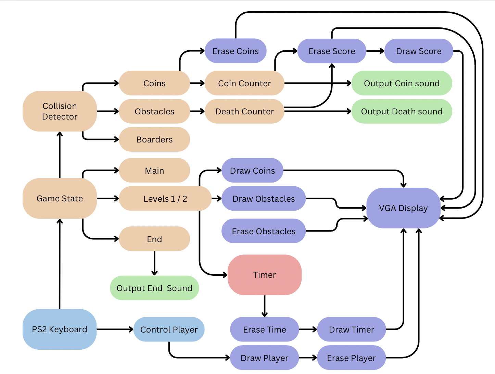

# The World's Hardest Game

This project is a recreation of the popular online game _The World's Hardest Game_, originally hosted on Cool Math Games.

Implemented in the **C programming language**, the game consists of two challenging levels where the player controls a red block and must navigate through moving blue obstacles and collect yellow coins to reach green safe zones.

The game runs on the **Nios V processor** and is displayed via **VGA output**, with sound output through the **DE1-SoC board speakers**. Input is provided through a **PS/2 keyboard**, supporting either the **WASD** or **arrow keys** for movement.

---

## 🛠️ Tech Stack

- **Language:** C  
- **Processor:** Nios V (Altera/Intel FPGA soft processor)  
- **Board:** DE1-SoC Development Board  
- **Display:** VGA output (pixel-level rendering)  
- **Audio:** DE1-SoC onboard speakers  
- **Input:** PS/2 Keyboard (WASD / Arrow Keys)  
- **Graphics Tools:**  
  - Canva (for main screen design)  
  - PNG-to-C array converter (for asset integration)

---

## 🎮 Gameplay Overview

- **Main Screen**  
  - Custom-designed using Canva and converted to a C array.  
  - The game begins when the **Space** key is pressed.

- **Level 1**  
  - Start in a green safe zone.  
  - Avoid moving blue obstacles and reach the end green zone.

- **Level 2**  
  - Collect all yellow coins before reaching the final green zone.

- **Game Mechanics**  
  - Pixel-level rendering of the player, obstacles, and coins on the VGA buffer.  
  - **Collision detection** is done by reading pixel colours directly from the VGA buffer.  
  - Colliding with an obstacle:  
    - Plays a **death sound**  
    - Increments the **death counter**  
    - Respawns the player at the start green zone  
    - Resets coin positions (in Level 2)  
  - Collecting a coin:  
    - Plays a **coin sound**  
    - Increments the **coin counter**  
  - Completing both conditions triggers the **end screen** with concluding music.  
  - Press **Escape** at any time to return to the main screen.

---

## 📸 Block Diagram

Below is the system-level block diagram:

  

---

## 📹 Demo Video

🎥 [Watch the Demo Video Here](https://drive.google.com/file/d/1BoZAGJSXcb0ABgDKVtCnGvAO_such8zC/view?usp=sharing)  

---

## 🚀 How to Run

1. Load the project into your Nios V development environment.  
2. Connect the DE1-SoC board to VGA, PS/2 keyboard, and speakers.  
3. Compile and upload the code.  
4. Start the game by pressing the **Space** key on the main screen.

---
